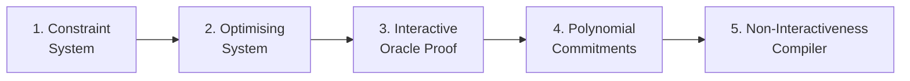

# ZKProof Standards
{: .no_toc }

## Table of contents
{: .no_toc .text-delta }

1. TOC
{:toc}

---

## ZKProof Standards Committee

The revision of the ZKProof structure in 2023 created a new team focused on developing a process for Specifications and Standards. The **"ZKProof Standards Committee"** will coordinate a process for development of specifications by ZKProof [Working Groups](https://docs.zkproof.org/standards/wg), and corresponding evaluation. The work can be directed (i) with the goal of future homologation as ZKProof community standard, or/and (ii) for future submission of ZKP specifications in reply to calls by other standardization bodies.

The composition of the ZKProof Standards Committee and of the approved Working Groups will be updated and publicly listed at [https://docs.zkproof.org/standards/wg](https://docs.zkproof.org/standards/wg).

## Plan for 2023/2024
The action reflected for the 2nd half of 2023 onward is focused on the creation of various **W**orking **G**roups (WG) that will develop concrete specifications. The focus in on five (5) modules that can be combined in a flow that enables a generic ZKP system, as follows:

**Putting all together.** The Standards Team will also seek to ensure that a specification is also developed on how to put together the various modules.

**Concrete instantiations per module.** To develop concrete instantiations for each module, various working groups are being created. While the identified focuses do not necessarily cover all possibilities, they intend to enable at least one concrete specification/implementation of a full generic ZKP system.

1. **Constraint System:**
   - Specification for PLONKish
   - Encoding constraint systems for various key-applications, such as for proving knowledge of a secret/private key or pre-image of various cryptographic primitives (e.g., related to a blockcipher [AES](https://csrc.nist.gov/pubs/fips/197/final), hash-functions [SHA2](https://csrc.nist.gov/pubs/fips/180-4/upd1/final)/[SHA3](https://csrc.nist.gov/pubs/fips/202/final), and signatures [RSA/ECDSA/EdDSA](https://csrc.nist.gov/pubs/sp/800/56/b/r2/final)).

2. **Optimising System:**
   - Corresponding permitted optimisations specific to the Plonkish constraint system.

3. **Interactive Oracle Proof (IOP)**
    - Polynomial interactive oracle proof as the information theoretic layer of the proving system. <small>**Note:** See more details at [ZkpComRef 0.3](https://docs.zkproof.org/reference.pdf) (chapter 2). </small>

4. **Oracle Compiler**:
    - Generic compiler for converting a PolyIOP to an interactive argument/proof using polynomial commitments.  This compiler should be agnostic to the polynomial commitment scheme being used.  In particular it should be compatible with:
        - Polynomial commitments over pairing groups such as KZG10.
        - Inner Product Arguments over pairing-free groups.
        - FRI (**F**ast **R**eed-Solomon **I**OP of Proximity)
    - Each polynomial commitment scheme will be covered by separate working groups.
5. **Non-Interactivenss (NI) compiler**
    - Fiat-Shamir transformation

## How to propose a new Working Group (WG)

Each new working group (for developing a specification) should be formally proposed to the ZKProof Standards Committee, by means of an abstract that identifies various key elements (see below). Upon internal analysis, the Standards Committee will seek initial advisory opinion from the ZKProof Steering Committee and the ZKProof Editors Team. This may result in direct acceptance, or in recommendations for improvement/adjustment of the proposal and re-submission. If/when a proposal is accepted, the plan of the WG will be [published](http://docs.zkproof.org/standards/proposals), and the team will be invited to present their yearly progress at ZKProof events.

At a minimum, the proposal of a working group for a specification must include:
1. Title of the working group (WG)
2. Initial team composition (names, affiliations, contact email-addresses)
3. A contact email address (may be a mailing list) to be publicly-displayed
4. An abstract (<=350 words) explaining the WG goal and expected deliverables
5. The expected structure, deliverables, and time-frame for the initial draft
6. A list of technical/scientific references related to the WG goal

Proposals are welcome, including for working groups on topics not listed above, e.g., alternative constraint systems (such as R1CS, AIR, or CCS). <small>**Legend:** AIR = **A**rithmetized **I**ntermediate **R**epresentation. CCS = **C**ustomizable **C**onstraint **S**ystem.  R1CS = **R**ank-**1** **C**onstraint **S**ystem.</small>

To propose a new WG, please email `standards (at) zkproof (dot) org`, cc'ing all members of the proposed team.