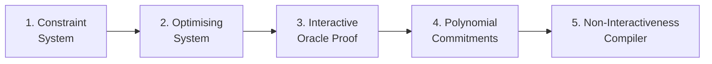

# ZKProof Standards
{: .no_toc }

## Table of contents
{: .no_toc .text-delta }

1. TOC
{:toc}

---

## ZKProof Standards Committee

The revision of the ZKProof structure in 2023 created a new team focused on developing a process for Specifications and Standards. The **"ZKProof Standards Committee"** will coordinate a process for development of specifications by ZKProof [Working Groups](https://docs.zkproof.org/standards/wg), and corresponding evaluation. These actions can be directed toward (i) future homologation of ZKProof community standards, or/and (ii) future submissions of ZKP specifications in reply to calls by other standardization bodies.

Since the 2nd half of 2023, the ZKProof Standards Committee has focused on motivating the creation of various **W**orking **G**roup**s** (WGs) that can develop concrete specifications. The first step to create a new ZKProof WG is contacting the Standards Committee by email: `standards at zkproof dot org`. Spontaneous proposals are welcome, including for WGs on topics not listed below, e.g., alternative constraint systems. To be considered for approval, there is a [formal process](https://docs.zkproof.org/standards/process) for proposing the WG, which involves submitting an abstract and other information.

## Plan for 2024/2025

The current main goal of the Standards Committe is to assist with the creation of WGs and support their development. One focus of interest is on modules useful for enabling a generic ZKP system, namely zk-SNARKs, as described in the following linear flow-chart:

It is also important to consider how to put together the various modules. Additionally, WGs can be created for developing relevant specifications that may be outside the scope of the above flowchart, as is the case with [Sigma Protocols](https://docs.zkproof.org/standards/wg#sigma).

## Example Working Groups (WGs)

More information on existing and past WGs can be found in the dedicated [ZKProof wepage of Working Groups](https://docs.zkproof.org/standards/wg). The following is a list topics and corresponding WGs that have either been created or whose creation is being promoted. A WG usually focuses on a concrete specification/implementation, rather than covering all ZKP possibilities within its topic/scope.

**WGs for modules useful for generic SNARKs:**

1. **Constraint System:** The **[PLONKish WG](https://docs.zkproof.org/standards/wg#plonkish)** is developing a specification for a PLONKish constraint system, including the encoding of constraint systems for various key-applications, such as for proving knowledge of a secret/private key or pre-image of various cryptographic primitives (e.g., related to a blockcipher [AES](https://csrc.nist.gov/pubs/fips/197/final), hash-functions [SHA2](https://csrc.nist.gov/pubs/fips/180-4/upd1/final)/[SHA3](https://csrc.nist.gov/pubs/fips/202/final), and signatures [RSA/ECDSA/EdDSA](https://csrc.nist.gov/pubs/sp/800/56/b/r2/final)).
2. **Optimising System:** A conceivable WG could formally specify optimisations applicable to some constraint system (e.g., for [Plonkish](https://docs.zkproof.org/standards/wg#plonkish)).
3. **Interactive Oracle Proof (IOP):** A conceivable WG could develop a specification for a Polynomial IOP (PolyIOP) as the information theoretic layer of a proving system (see details in chapter 2 of  [ZkpComRef 0.3](https://docs.zkproof.org/reference.pdf)).
4. **Oracle Compiler**: The **[Oracle Compiler WG](https://docs.zkproof.org/standards/wg#oracle)** is developing a specification for a generic compiler for converting a PolyIOP into an interactive argument/proof using polynomial commitments.  The compiler should be agnostic to the polynomial commitment scheme being used.  Each polynomial commitment scheme would be covered by a separate WG.
7. **Non-Interactivenss (NI) compiler:** The **[Fiat-Shamir WG](https://docs.zkproof.org/standards/wg#fiat-shamir)** is developing a specification for the Fiat-Shamir transformation.

**Other WGs:**

- **Sigma Protocols:** The **[Sigma Protocols WG](https://docs.zkproof.org/standards/wg#sigma)** is developing a specification about $\Sigma$-protocols, which are mature, stable, well-understood, standalone protocols suitable for important, simple relations. The WG aims to bridge across various external efforts, including by IETF ([OPRF](https://datatracker.ietf.org/doc/html/draft-irtf-cfrg-voprf-03#section-5), [Schnorr](https://datatracker.ietf.org/doc/html/rfc8235)), NIST ([Threshold Call](https://csrc.nist.gov/projects/threshold-cryptography)), and W3C ([BBS+ signatures](https://decentralized-id.com/web-standards/w3c/verifiable-credentials/data-integrity-bbs+/)). The WG takes in consideration various past interventions that suggested the need for standardization of Schnorr proofs, such as a [letter to NIST (2016)](https://zkp.science/docs/Letter-to-NIST-20160613-Advanced-Crypto.pdf) and a [keynote by Camenish (2019)](https://www.youtube.com/watch?v=4_QdsFM29fQ).

## Useful ZKProof links for further context:
- ZKProof Internal structure: [https://docs.zkproof.org/about](https://docs.zkproof.org/about)
- ZKProof Working Groups: [https://docs.zkproof.org/standards/wg](https://docs.zkproof.org/standards/wg)
- ZKProof Standards Process: [https://docs.zkproof.org/standards/process](https://docs.zkproof.org/standards/process)

For comments and updates, please email `standards at zkproof dot org`